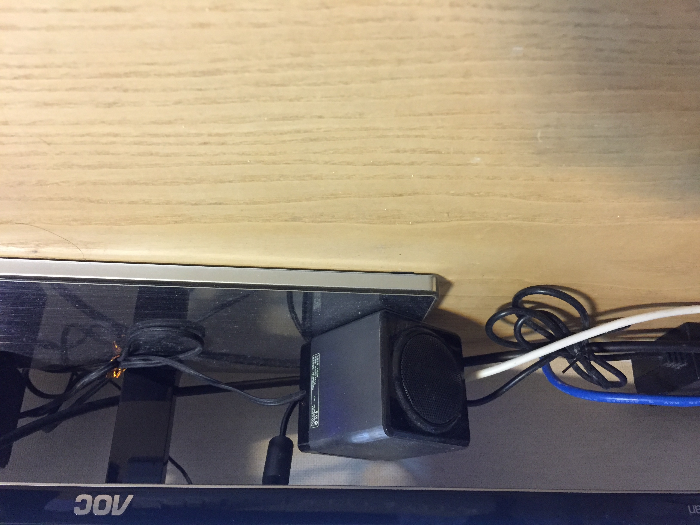

# YoloGround
Labelling 

C#
.NET Framework 4.6.1  
Window x64

yolo 학습에 사용할 Object 좌표 등록 프로그램.

- Ctrl + Mouse Drag  : 좌표 등록
- Number key : Object Id 변경(1초 reset)
- 방향키 : 이미지 변경
- Object ID는 기본 20개가 추가됨. 
- wheel : zoom

  <h2>issue</h2>  

- 이미지 meta 정보에 있는 방향이 있으면 어떤 기준으로 맞춰야 할지 모르겠다.
darknet 에서 방향을 틀어서 계산을 하는지 아님 어떤 기준으로 하는지 찾기 복잡다....
그래서 그냥 meta 정보를 삭제하고 하는게 .....알아서.....

- 포함된 이미지의 경우 Meta Orientation 이 3 Bottom이 위로 가게 된다.
이미지 툴 마다 처리 여부에 따라 달리 보이게 된다.
그래서 이전 internet Explorer 에서 열게 되면 사진이 거꾸로 표시 된다.

- Yolo 학습 하기전 이미지에 있는 Meta data를 모두 지우고 시작하는게 생명연장에 도움이 될듯 하다.
서로 다른 이미지툴 사용으로 어느게 맞는지 재확인 시간과 좌표 상이 함으로 머리털이 빠질 수 있음.
방향 0 과 1을 제외하고는 삭제를 권장합니다. 여러분들의 노후 생활을 위해서....

- https://github.com/nosoogja/ImgResave

